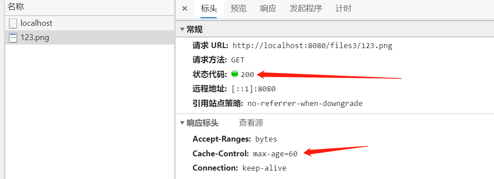
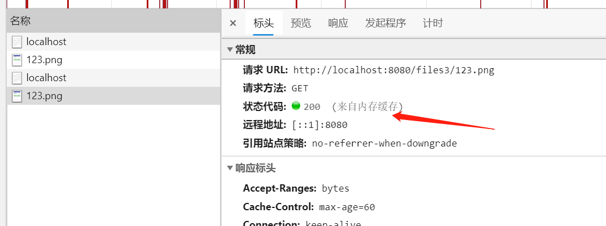
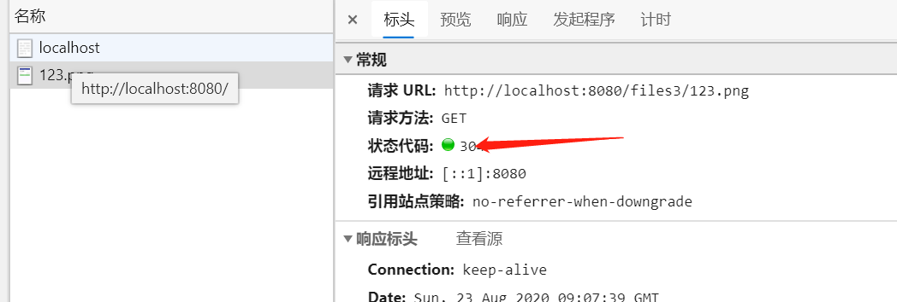

# Spring boot实现上传文件的预览和http缓存
续前节[文件的简单上传和下载](./文件的简单上传和下载.md)  
## 如何实现图片在浏览器中的显示
在之前的简单示例中，实现了文件的上传和下载，但随之而来的另外一个问题发生了。  
我向服务器上传了一个图片，然后在浏览器中输入相应的下载链接，会发现文件直接被下载到了本地，而当我们使用其它静态服务器，或者spring-boot/tomcat/apache server的静态资源时，我们输入对应的图片地址，浏览器会直接将图片显示出来，而不是下载到本地。  
为什么会出现这样的差异呢？这涉及到http的Content-Type响应头。  
实体头部用于指示资源的MIME类型 media type 。浏览器会根据不同的响应类型，来判定如何处理响应。比如当检测到响应头为text/html时，浏览器会执行html渲染，当检测到响应头为video/mp4时，会执行视频播放。  
更详细的响应头可以参考[https://developer.mozilla.org/zh-CN/docs/Web/HTTP/Headers/Content-Type](https://developer.mozilla.org/zh-CN/docs/Web/HTTP/Headers/Content-Type)和[https://developer.mozilla.org/en-US/docs/Web/HTTP/Basics_of_HTTP/MIME_types](https://developer.mozilla.org/en-US/docs/Web/HTTP/Basics_of_HTTP/MIME_types)
## 自定义响应头
在代码中如何定义响应头？其实在前面的代码中已经有过示例。
```java
  return ResponseEntity.ok()
                    // 指定文件的contentType
                    .contentType(MediaType.APPLICATION_OCTET_STREAM)
                    .body(resource);
```
.contentType()方法就是用于指定响应头的代码。  
我们只需要根据文件类型返回不同的响应头即可。我们重新定义一个controller来实现下载逻辑
```java
@RequestMapping("files2")
@RestController
public class FileController2 {

    private String path = "d:" + File.separator + "uploader";

    private final Map<String, String> mediaTypes;

    public FileController2() {
        mediaTypes = new HashMap<String, String>();
        mediaTypes.put("mp4", "video/mp4");
        mediaTypes.put("jpeg", "image/jpeg");
        // ...这里添加更多的扩展名和contentType对应关系
    }

    @GetMapping("{filename}")
    public ResponseEntity<InputStreamSource> download(@PathVariable("filename") String filename)
            throws FileNotFoundException {
        // 构建下载路径
        File target = new File(path + File.separator + filename);
        // 构建响应体
        if (target.exists()) {
            // 获取文件扩展名
            String ext = filename.substring(filename.lastIndexOf(".") + 1);
            // 根据文件扩展名获取mediaType
            String mediaType = mediaTypes.get(ext);
            // 如果没有找到对应的扩展名，使用默认的mediaType
            if (Objects.isNull(mediaType)) {
                mediaType = MediaType.APPLICATION_OCTET_STREAM_VALUE;
            }
            InputStreamSource resource = new FileSystemResource(target);
            return ResponseEntity.ok()
                    // 指定文件的contentType
                    // contentType方法只能支持Spring内置的一些mediaType类型
                    // 但我们会由一些其它的MediaType类型，比如video/mp4等，这时我们需要直接通过字符串设置响应头
                    // .contentType(MediaType.APPLICATION_OCTET_STREAM)
                    .header("Content-Type", mediaType)
                    .body(resource);
        } else {
            // 如果文件不存在，返回404响应
            return ResponseEntity.notFound().build();
        }
    }
}
```
代码解析  
对比之前的简单上传，其实只修改了两个地方
* 使用map存储文件扩展名和Content-Type的对应关系
* 在返回http header的时候，根据不同的扩展名响应不同Content-Type
* 浏览器是根据响应头中的Content-Type来确定浏览器行为的。而不是根据文件扩展名。比如请求的地址是http://xxx.xxx.com/video.mp4 但响应的Content-Type是text/html,浏览器也会将内容作为html渲染，而不是作为mp4播放(哪怕真实内容不是html).
## HTTP缓存
当我们的上传服务会作为图片文件服务器存在时。就会存在文件预览问题。但如果每次浏览都发生实际的服务请求，对服务器的压力是比较大的。这时，http缓存机制就派上了用场。  
关于缓存的更多细节，可以参考
* [HTTP 缓存(在MDN上)](https://wiki.developer.mozilla.org/zh-CN/docs/Web/HTTP/Caching_FAQ)  
* [Hypertext Transfer Protocol (HTTP/1.1): Caching](https://tools.ietf.org/html/rfc7234)
* [HTTP Cache-Control Extensions for Stale Content](https://tools.ietf.org/html/rfc5861)  

而在下载在实现中，通常考虑三组请求头
* Cache-Control  
    **Cache-Control**是一个通用消息头字段，被用于在http请求和响应中，通过指定指令来实现缓存机制。缓存指令是单向的，这意味着在请求中设置的指令，不一定被包含在响应中（以上解析来源于MDN）。  
    意思是这个头可以用在请求头上，也可以用在响应头上。请求头可以通过一些指令来要求服务器进行响应的缓存操作。而服务器也可以通过响应头高速浏览器你可以按照我的返回信息进行资源的缓存操作。但这些都不是必须的，也就是说对于浏览器的指令，服务器可以不予理睬。而对于客户端来说，客户端也可以忽略这些指令。  
    通常情况下，我们只需要设置服务端响应头的Cache-control就可以达到有效控制浏览的目的。
* ETags和If-None-Match  
  **响应头ETag** 系统中对资源的签名，根据http协议，ETag是按字节计算，即当资源中的某个字节发生改变时，Etag也应该随之改变。  
  **请求头If-None-Match** 当浏览器第一次请求某个资源时，如果资源响应包含了ETag响应头，则浏览器会保存该请求头。当浏览器第二次请求该请求该资源时，服务器会校验该值，如果该值和服务器保存的该值一致，则服务器直接返回304状态码，而不返回完整的响应体
* Last-Modified和If-Modified-Since  
  **响应头Last-Modified**含源头服务器认定的资源做出修改的日期及时间。它通常被用作一个验证器来判断接收到的或者存储的资源是否彼此一致。由于精确度比ETag要低，所以这是一个备用机制  
  **请求头If-Modified-Since**是一个条件式请求头，服务器只在所请求的资源在给定的日期时间之后对内容进行过修改的情况下才会将资源返回，状态码为200。当浏览器第一次请求资源时，会返回Last-Modified响应头。浏览器会保存该值，并在第二次请求该资源时将该值作为If-Modified-Since的值提交到服务器，服务器应该验证该值，如果请求的资源从那时起未经修改，那么返回一个不带有消息主体的304响应。

增加了http缓存模型的请求流程如下  
1. 浏览器发送请求，服务器响应资源，并在响应头中返回Cache-Control,ETags,Last-Modified
2. 当浏览器再次访问同一资源时，浏览器首先检测Cache-Control,确定本地资源是否过期，如果没有过期，则直接使用本地已经下载的资源
3. 如果缓存已经过期，浏览器重新发起请求，并附加该资源的请求头Etag,If-Modified-Since。
4. 服务器首先对比客户端的Etag,if-Modified-Since,如果Etag值一致，或者服务端资源在if-Modified-Since之后未发生变化。则直接返回http 304状态码，否则返回200状态码，并返回完整的内容和新的Etag和Last-Modified值。注意：Etag,if-Modified-Since两个头同时请求时，服务器应该忽略if-Modified-Since值。

针对以上的流程，我们重新改造一下之前的服务器端代码。
以下是完整的代码清单
```java
/**
 * 增加了缓存的下载
 * 
 * @author LiDong
 *
 */
@RequestMapping("files3")
@RestController
public class FileController3 {

    private String path = "d:" + File.separator + "uploader";

    private final Map<String, String> mediaTypes;

    public FileController3() {
        mediaTypes = new HashMap<String, String>();
        mediaTypes.put("mp4", "video/mp4");
        mediaTypes.put("jpeg", "image/jpeg");
        mediaTypes.put("jpg", "jpg");
        mediaTypes.put("png", "image/png");
    }

    @GetMapping("{filename}")
    public ResponseEntity<InputStreamSource> download(@PathVariable("filename") String filename,
            WebRequest request)
            throws FileNotFoundException {
        // 构建下载路径
        File target = new File(path + File.separator + filename);
        // 构建响应体
        if (target.exists()) {
            // 获取文件的最后修改时间
            long lastModified = target.lastModified();
            if (request.checkNotModified(lastModified)) {
                return ResponseEntity.status(HttpStatus.NOT_MODIFIED).build();
            }
            // 获取文件扩展名
            String ext = filename.substring(filename.lastIndexOf(".") + 1);
            // 根据文件扩展名获取mediaType
            String mediaType = mediaTypes.get(ext);
            // 如果没有找到对应的扩展名，使用默认的mediaType
            if (Objects.isNull(mediaType)) {
                mediaType = MediaType.APPLICATION_OCTET_STREAM_VALUE;
            }
            InputStreamSource resource = new FileSystemResource(target);
            return ResponseEntity.ok()
                    // 指定文件的缓存时间，这里指定60秒，高速浏览器在60秒之内不用重新请求
                    .cacheControl(CacheControl.maxAge(60, TimeUnit.SECONDS))
                    // 返回文件的最后修改时间
                    .lastModified(lastModified)
                    // 指定文件的contentType
                    // contentType方法只能支持Spring内置的一些mediaType类型
                    // 但我们会由一些其它的MediaType类型，比如video/mp4等，这时我们需要直接通过字符串设置响应头
                    // .contentType(MediaType.APPLICATION_OCTET_STREAM)
                    .header("Content-Type", mediaType)
                    .body(resource);
        } else {
            // 如果文件不存在，返回404响应
            return ResponseEntity.notFound().build();
        }
    }
}
```
以上代码主要引入了如下变化
1. 参数中引入了WebRequest，它包装了一些通用的请求信息，在某些文章中可能会使用HttpServletRequest来获取相关的信息，但对于应用来说，一般不建议这么做，因为现在Spring的webflux技术，可能在我们的服务端中不会存在HttpServletRequest,而WebRequest是针对web请求的一个通用封装，并不依赖于特定的服务器类型。 
2. 在返回请求体前增加了checkNotModified校验。这样当资源没有改变时，会直接返回http 304.
3. 在响应头中增加了cacheControl和lastModified设置，以便浏览器可以针对这些响应头实现缓存策略.
## 缓存测试
* 为了测试缓存是否生效，我们首先上传一个图片到指定位置(其它直接复制一个图片到上传目标文件夹即可)。
* 在src\main\resources\statics中新建一个简单的index.html,使用img标签引入我们上传的文件。
```
<!DOCTYPE html>
<html>
<head>
<meta charset="UTF-8">
<title>Insert title here</title>
</head>
<body>
	
</body>
</html>
```
启动服务器，并启动浏览器，按f12打开开发者窗口，打开网络栏，输入http://localhost:8080/,观察对 files3/123.png的请求

第一次请求时，会向服务器请求图片，服务器返回200请求，并将图片渲染到页面上。  

持续刷新页面，观察后续的图片请求，会发现它的响应头为来自内存缓存.  

等待一分钟之后,再刷新浏览器，这时服务端会返回状态码304,告诉浏览器图片没有发生改变。  

至此一个简单的缓存逻辑就做好了。  
再示例中没有计算Etag，但基本逻辑就是使用某种算法计算资源的hash值(或其它特征值)再响应的时候将etag值返回给浏览器，而在返回响应体时，校验一个客户端的传入值是否和服务器当前资源的特征值一致，如果一致，就返回304.可以自行尝试一下。

项目代码


