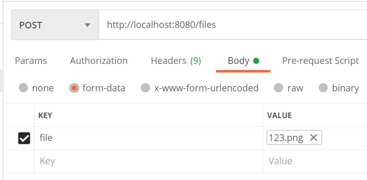

# 三两行代码实现文件的上传和下载
本示例记录Spring Boot 2.x中文件的上传，整个上传逻辑只有两三行代码。
## 一、文件的上传
```java
@RequestMapping("files")
@RestController
public class FileController {

    // 确定存储文件的目录
    private String path = "d:" + File.separator + "uploader";

    @PostMapping
    public Map<String, Object> upload(@RequestParam("file") MultipartFile file)
            throws IllegalStateException, IOException {
        // 获取原始文件名
        String filename = file.getOriginalFilename();
        // 构建保存目标
        File target = new File(path + File.separator + filename);
        // 将文件转移到指定目录
        file.transferTo(target);
        // 构建响应
        Map<String, Object> response = new HashMap<>();
        response.put("target", target.getAbsolutePath());
        return response;
    }

    @PostConstruct
    public void initStorage() {
        File target = new File(path);
        if (!target.exists()) {
            if (target.mkdirs()) {
                System.out.println("文件存储目录创建成功。");
            } else {
                System.err.println("文件存储目录创建失败。");
            }
        }
    }
}
```
**代码解析：**  
基于Restful风格构建的文件上传逻辑。文件上传的逻辑写在upload方法中。  
* 使用属性path存储文件的保存位置，这个可以放在配置文件中。
* MultipartFile是Spring提供的，解析multipart request后,对于请求中的文件的包装。它提供了一些常用的方法来操作文件。包括获取文件名，获取文件长度，获取原始文件名等。
* 使用MultipartFile.transferTo(target)将文件保存到指定目标位置。
* initStorage方法用于在系统启动时，初始化文件存储目录，这里没有考虑到各种异常情况。上传的关键不在这里。
* 关于异常处理：在上传的逻辑中没有处理各种异常，转而交由Spring boot的统一异常处理逻辑来处理异常。  
**测试：**  
使用postman进行一个简单的测试

* 注意输入正确的地址
* 方法选择post
* body选择form-data
* 给定一个名称为file参数(和controller中的RequestParam对应)，value选择一个文件。
**可能发生的错误**  
* Maximum upload size exceeded。这时由于上传文件的大小超过了服务器可以接受的上限导致的。
可以通过配置服务器请求大小限制来解决，修改application.yml,添加如下配置
```yml
spring:
  servlet:
    multipart:
      max-file-size: 200MB
      max-request-size: 200MB
```
* spring.servlet.multipart.max-file-size #用于控制multipart request中，单个文件的大小
* spring.servlet.multipart.max-request-size #用于控制multipart request中，整体请求的大小(一个上传请求可以添加多个文件，所有文件的大小总和不能超过该数值)。
## 二、文件的下载
继续在controller中添加下载代码逻辑
```java
    @GetMapping("{filename}")
    public ResponseEntity<InputStreamSource> download(@PathVariable("filename") String filename) {
        // 构建下载路径
        File target = new File(path + File.separator + filename);
        // 构建响应体
        if (target.exists()) {
            FileSystemResource resource = new FileSystemResource(target);
            return ResponseEntity.ok()
                    // 指定文件的contentType
                    .contentType(MediaType.APPLICATION_OCTET_STREAM)
                    .body(resource);
        } else {
            // 如果文件不存在，返回404响应
            return ResponseEntity.notFound().build();
        }
    }
```
**代码解析:**  
* 使用restful风格的api
* 使用ResponseEntity<InputStreamSource>作为响应。
* InputStreamSource是Spring提供的，对于InputStream作为响应时的包装对象，它能简化对于使用InputStream作为响应时的编程。网上很多其它文章都是通过获取response中的outputStream,然后向outputStream中写入数据来实现下载，稍显复杂。
* FileSystemResource是InputStreamSource的一个实现。它使用nio来实现数据的复制，能够显著的减少在文件下载时CPU的使用量（具体实现在不同的平台中会有所差别，相关概念参考 《[零复制](https://baike.baidu.com/item/%E9%9B%B6%E5%A4%8D%E5%88%B6)》）。
## 小结
这应该是Spring boot中最简单的文件上传和下载功能了,而且从理论上来将，性能也是比较优秀的(利用了nio)。但功能还是相对简单。接下来还会实现文件的断点续传，视频的拖动播放等功能。
